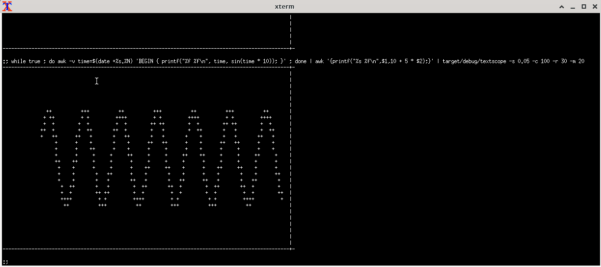

# This is textscope, a minimal text based scope trace for streams of data where each line contains an epoch and value

It's a bit like a command line oscilloscope.

## Use case

* You are monitoring a changing value in a stream of text.
* You are not great at visualising numbers as graphs, particularly when the readings arrive fast.
* You are logged on to a remote machine and you are too lazy to set up X window, Octave or Gnuplot.
* You just want a quick look at the data and you are not at all fussy about axis labels, etc.
* You don't want the graph to scroll up the screen - because that would be really easy to do anyway :-)

## Rust version

This is just an excuse to write some Rust.

I appear to be using this:

    :; cargo --version
    cargo 1.63.0 (fd9c4297c 2022-07-01)

I installed Rust using the method described here:

    https://www.rust-lang.org/tools/install

## Build instructions

I'm using Linux (and I'm not sure that this would work on Windows because of the signal handling ...)

    git clone git@github.com:sjaturner/textscope.git
    cd textscope
    cargo build
    for y in $(seq 1 2000) ; do echo $(( y % 0xff )) ; sleep 0.005 ; done | ts %.s | target/debug/textscope -s 0.01

The last command is a quick test - you should see a ramp waveform scrolling across the screen: hit CTRL-C 
when you're bored of that.

## Expected input format

I will build on the following example:

You might have a simple stream of values, lacking a timestamp:

    :; count=0;while true; do echo $(( $count % 5 )) ; count=$(( $count + 1 )) ; sleep 0.2 ; done
    0
    1
    2
    3
    4
    0
    1
    2

In which case you can add an epoch prefix by adding on to the end of the pipe ...

    :; count=0;while true; do echo $(( $count % 5 )) ; count=$(( $count + 1 )) ; sleep 0.2 ; done | while read line ; do echo $(date +%s.%N) $line ; done
    1661597530.438190298 0
    1661597530.638984744 1
    1661597530.839688452 2
    1661597531.040392101 3
    1661597531.241145565 4
    1661597531.441867471 0
    1661597531.642564173 1
    1661597531.843254898 2
    1661597532.043929500 3

I'll refer to that second line item as the value from now on.

So much for input data ... Let's try some plots!

## Altering the values to work with textscope

The textscope wants the input data values to be row numbers on the screen. It's in the help text for the program:

    textscope 0.1.0
    This is a simple text scope which reads stdin and expect two input values per line The first input
    value is epoch The second is the reading to be displayed on the scope

    USAGE:
        textscope [OPTIONS]

    OPTIONS:
        -c, --columns <COLUMNS>      Number of columns to use [default: 80]
        -h, --help                   Print help information
        -m, --max-vals <MAX_VALS>    The maximum value expected in the data column [default: 256]
        -r, --rows <ROWS>            Number of rows to use [default: 25]
        -s, --step <STEP>            Time step per column [default: 1]
        -V, --version                Print version information

Plotting what we had from the example above:

    :; count=0;while true; do echo $(( $count % 5 )) ; count=$(( $count + 1 )) ; sleep 0.2 ; done | while read line ; do echo $(date +%s.%N) $line ; done | target/debug/textscope -m 6 -s 0.05
    -------------------------------------------------------------------------------+-
                                                                                   |
                                                                                   |
                                                                                   |
                                                                                   |
                                                                                   |
                                                                                   |
                                                                                   |
            +                   +                   +                   +          |
                                                                                   |
                                                                                   |
                                                                                   |
        +                   +                   +                   +              |
                                                                                   |
                                                                                   |
                                                                                   |
    +                   +                   +                   +                  |
                                                                                   |
                                                                                   |
                                                                                   |
                    +                   +                   +                   +  |
                                                                                   |
                                                                                   |
                                                                                   |
    ------------+-------------------+-------------------+-------------------+------+-

You can see that we're plotting a ramp. The -m parameter is 6 so the vertical range of the plot is 0..6.
The -s parameter is the seconds per column, if this were an actual scope then that would be the timebase.

NOTE: I've tried to make this behave nicely with CTRL-C (used to stop the scope). However, sometimes
the ^C gets printed in the output text which rather spoils the last display. That's a shame because
you might want to paste that somewhere ... To improve matters, you can do this:

    :; stty -echoctl

If you are really attached to seeing ^C, etc. you can try this after you're finished:

    ;; stty sane

Which prevents the ^C from being printed. That tends to work a lot better but there's still an occasional
glitch if you make big displays.

If you'd like a wider display, try setting -c to something larger than 80.

## A more complicated example

    :; while true ; do awk -v time=$(date +%s.%N) 'BEGIN { printf("%f %f\n", time, sin(time * 10)); }' ; done | head -3
    1661596814.448602 0.294532
    1661596814.450095 0.280231
    1661596814.451587 0.265874

As you can see, that's just AWK (actually GNU Awk 5.0.1) printing a sine wave. Literally a sine of the times.
There is a bash outer loop which keeps it going. Each line has the UNIX epoch, to a reasonable precision and
the sine of that.

Clearly, the value is too small to be seen - textscope wants row number. Fortunately, there's AWK - which can do
a bit of maths on an input stream without much trouble.

    :; while true ; do awk -v time=$(date +%s.%N) 'BEGIN { printf("%f %f\n", time, sin(time * 10)); }' ; done | awk '{printf("%s %f\n",$1,10 + 5 * $2);}' | target/debug/textscope -s 0.005 -c 200 -r 40 -m 20
    -------------------------------------------------------------------------------------------------------------------------------------------------------------------------------------------------------+-
                                                                                                                                                                                                           |
                                                                                                                                                                                                           |
                                                                                                                                                                                                           |
                                                                                                                                                                                                           |
                                                                                                                                                                                                           |
                                                                                                                                                                                                           |
                                                                                                                                                                                                           |
                                                                                                                                                                                                           |
                                                                                                                                                                                                           |
                                                                                                           +++++++++++++++++++                                                                             |
                                                                                                       +++++                 +++++                                                                         |
                                                                                                    ++++                         ++++                                                                      |
      ++++                                                                                        +++                               +++                                                                    |
         +++                                                                                   +++                                     +++                                                                 |
           +++                                                                               +++                                         +++                                                               |
              ++                                                                           +++                                             +++                                                             |
                ++                                                                       ++                                                  +++                                                           |
                  ++                                                                   ++                                                      +++                                                         |
                    +++                                                              ++                                                           ++                                                       |
                      +++                                                         +++                                                              +++                                                     |
                        ++                                                       ++                                                                  +++                                                   |
                          +++                                                  ++                                                                       ++                                                 |
                            +++                                             +++                                                                           ++                                               |
                              +++                                         +++                                                                               +++                                            |
                                +++                                     +++                                                                                   +++                                          |
                                   +++                               +++                                                                                        ++++                                       |
                                     ++++                         ++++                                                                                             +                                       |
                                        +++++                 +++++                                                                                                                                        |
                                            +++++++++++++++++++                                                                                                                                            |
                                                                                                                                                                                                           |
                                                                                                                                                                                                           |
                                                                                                                                                                                                           |
                                                                                                                                                                                                           |
                                                                                                                                                                                                           |
                                                                                                                                                                                                           |
                                                                                                                                                                                                           |
                                                                                                                                                                                                           |
                                                                                                                                                                                                           |
    -------------------------------------------------------------------------------------------------------------------------------------------------------------------------------------------------------+-

Interestingly, with this running at a higher rate, the right hand edge of the plotted value starts a little
before the right hand limit of the plot. I think that's buffering in AWK! If you want to do higher speed plots
you might want to force the pipeline elements to flush.

## Imaginary Frequently Asked Questions and unhelpful answers

* Does this work on Windows?

    I've not tried that. The terminal handling claims to be cross platform but I don't know about the signal handling code. Send a PR if you can make it work.

* Where are the nice axis lables and other decorations? How can I tell what the scale and offset are?

    I'm assuming you scaled and offset the data yourself ...

* Can I plot more than one trace?

    I wondered about that too - perhaps I could adapt this to take multiple values on each line. It'd be up to you to scale all of them though ... Might try at some point.
    
* Would this look nicer if you used sixel plots?

    That would be great, but my terminal multiplexer (tmux) destroys sixel ...
